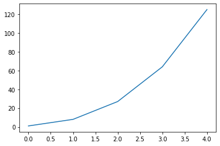
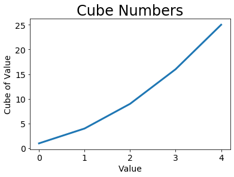
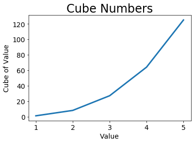
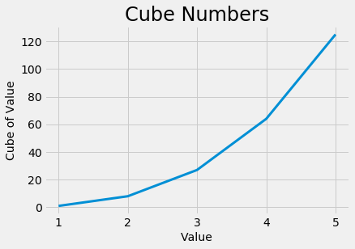
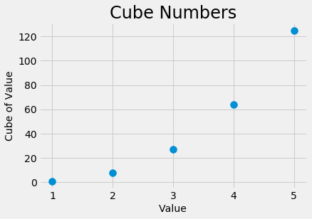
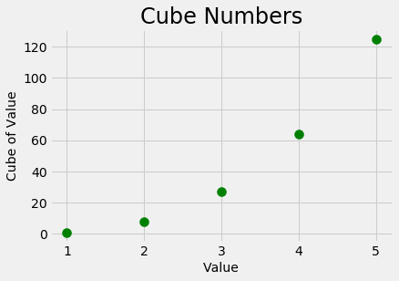
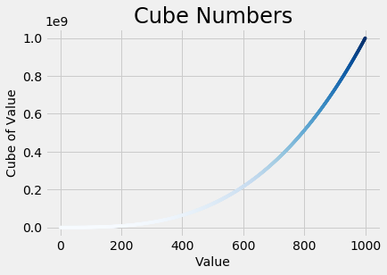

# Data-Viz-with-matplotlib

Making beautiful data representations with matplotlib

## Plotting a Simple Line Graph

We first import the **_pyplot_** module using the alias plt:

```python
import matplotlib.pyplot as plt
```

We create a list called cubes to hold the data that we’ll plot. Then we follow another common Matplotlib convention by calling the subplots() function:

```python
cubes = [1, 8, 27, 64, 125]
fig, ax = plt.subplots()
```

This function can generate one or more plots in the same fig­ure.
The variable fig represents the entire figure or collection of plots that are generated. The variable ax represents a single plot in the figure and is the variable we’ll use most of the time.

We then use the plot() method, which will try to plot the data it’s given in a meaningful way:

```python
ax.plot(cubes)
```

The function plt.show() opens Matplotlib’s viewer and displays the plot:



## Changing the Label Type and Line Thickness

We use a few of the available customizations to improve plot’s readability:

```python
ax.plot(cubes, linewidth=3)
```

The linewidth parameter controls the thickness of the line that plot() generates.

```python
# Set chart title and label axes.
ax.set_title("Cube Numbers", fontsize=24)
ax.set_xlabel("Value", fontsize=14)
ax.set_ylabel("Cube of Value", fontsize=14)

# Set size of tick labels.
ax.tick_params(axis='both', labelsize=14)

```

The set_title() method sets a title for the chart.
The set_xlabel() and set_ylabel() methods allow you to set a title for each of the axes, and the method tick_params() styles the tick marks



## Correcting the Plot

we see that the data is not plot­ted correctly,We can override the default behavior by giving plot() the input and output values:

```python
values = [1, 2, 3, 4, 5]
cubes = [1, 8, 27, 64, 125]
ax.plot(values, cubes, linewidth=3)
```



# Using Built-in Styles

Matplotlib has a number of predefined styles available that will make visualizations appealing.
To see the styles available, run the following lines in a terminal session:

```python
import matplotlib.pyplot as plt
plt.style.available
```

To use any styles, add one line of code before starting to generate the plot:

```python
plt.style.use('fivethirtyeight')
```



# Plotting a Series of Points with scatter()

To plot a series of points, we can pass scatter() separate lists of values:

```python
values = [1, 2, 3, 4, 5]
cubes = [1, 8, 27, 64, 125]
ax.scatter(values, cubes, s=100)
```

The **s** argument set the size of the dots used to draw the graph:



# Defining Custom Colors

To change the color of the points, pass c to scatter() with the name of a color to use in quotation marks:

```python

ax.scatter(values, cubes, c='green', s=100)
```



# Using a Colormap

A colormap is a series of colors in a gradient that moves from a starting to an ending color. You use colormaps in visualizations to emphasize a pattern in the data.

```python
from math import pow

values = range(1, 1001)
cubes = [pow(x, 3) for x in values]

ax.scatter(values, cubes, c=cubes, cmap=plt.cm.Blues, s=10)
```



You can see all the colormaps available in pyplot at [matplotlib web site][1]

Code of this section can be find [Here][2].

[1]: https://matplotlib.org/gallery/color/colormap_reference.html#sphx-glr-gallery-color-colormap-reference-py
[2]: mpl_cube.ipynb
